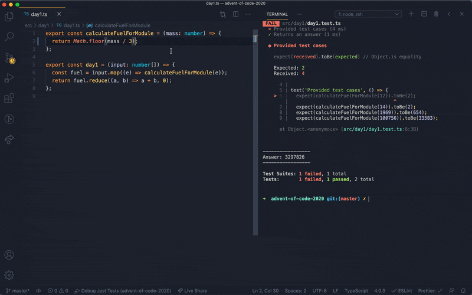

# Typescript Advent of Code Starter

Basic template project for convenient Advent of Code problem solving! Project contains latest version of TS and Prettier for auto code formatting. Jest tests for instant feedback and debugging.

Bash script included to auto generate boilerplate and project structure for each day.

The `parseInput` function will also try to parse the puzzle input for you but beware! I have no idea what formats the inputs will be in this year...

Happy Advent!

## Why?

Writing input parsing and project structure boilerplate every day is annoying. Having instant test feedback is really useful. E.g.

## Instant test feedback

Run `yarn test` which will start jest in watch mode. Run in vscode terminal for instant feedback. By default it will run for files that have changed in git. Commit previous days so their tests don't run anymore.

## New day boilerplate

You will need to run `chmod +x newDay.sh` so you can run it.
Then run `yarn day {day}` e.g. `yarn day 2` will create a `day2` folder with `day2.ts`, `day2.test.ts` and `day2.data.ts` files with boilerplate code.

## Debugging

The `Debug Jest Tests` debug config will run your jest tests and let you breakpoint through them.

## Convenience methods

`log()` will log to stdout but without the annoying linenumbers from jest. If you want linenumbers use `console.log()`.
